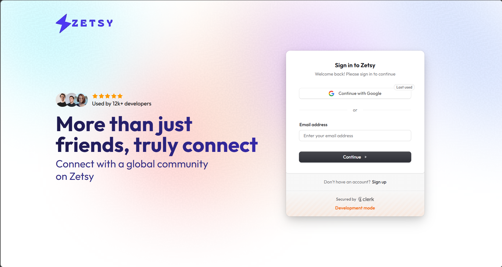
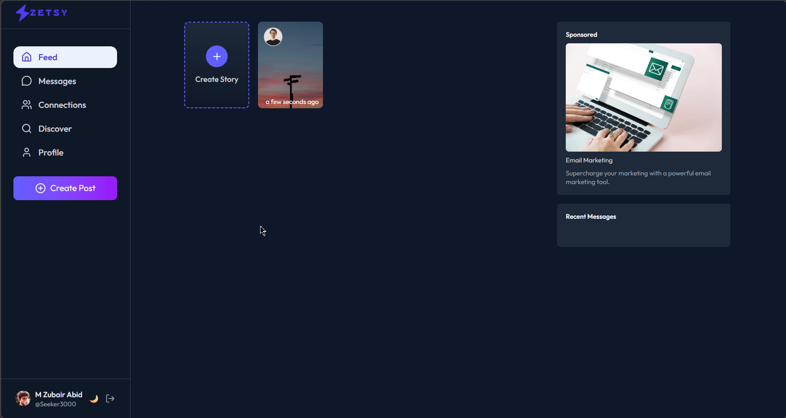
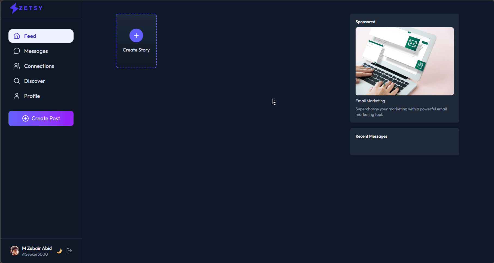
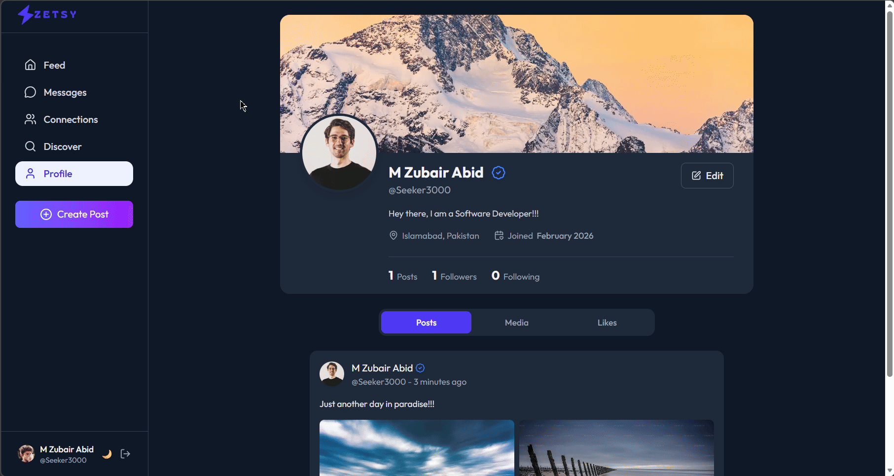
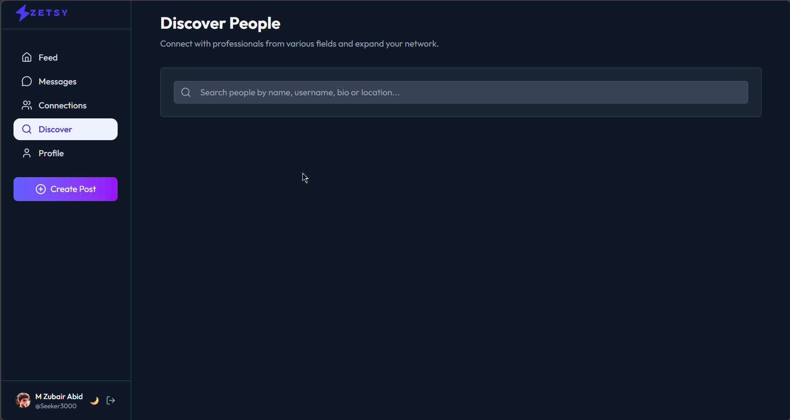
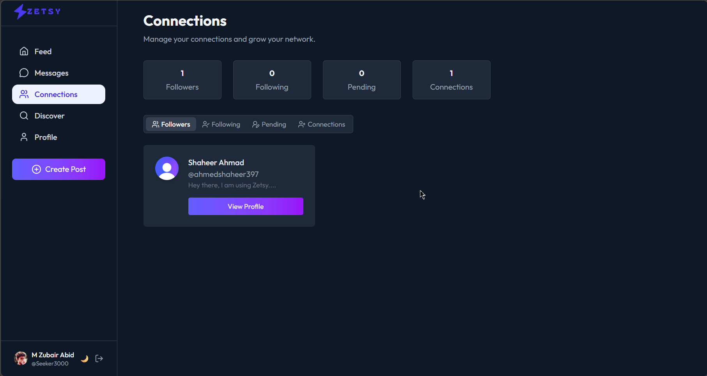
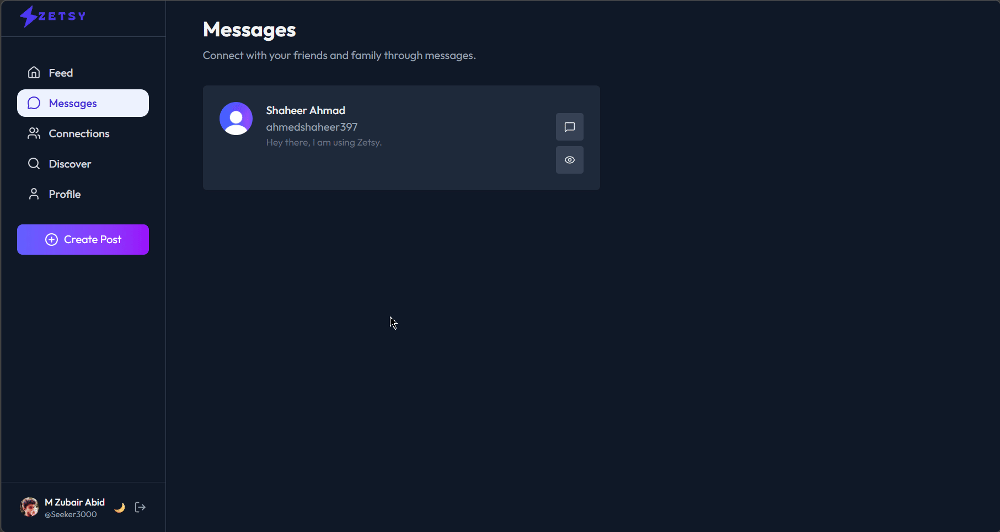

<div>
  
</div>

# Zetsy - Social Media Platform

A modern, full-stack social media application built with MERN stack, featuring real-time messaging, stories, posts, and user connections.

<p align="center">
  
</p>










## ✨ Features

- **User Authentication** - Secure authentication powered by Clerk
- **Posts** - Create posts with image uploads
- **Stories** - Share temporary stories with image & video support
- **Real-time Messaging** - Private messaging between users
- **Connections** - Follow/unfollow users and manage connections
- **User Profiles** - Customizable user profiles with bio, profile pictures & cover photos
- **Notifications** - Stay updated with real-time notifications
- **Discover** - Find and connect with new users
- **Responsive Design** - Fully responsive UI with dark/light theme support

## 🛠️ Tech Stack

### Frontend
- **React** - UI library
- **Vite** - Build tool and dev server
- **Redux Toolkit** - State management
- **React Router** - Client-side routing
- **Clerk** - Authentication and user management
- **Tailwind CSS** - Styling framework
- **Axios** - HTTP client
- **Lucide React** - Icon library
- **React Hot Toast** - Toast notifications
- **Moment.js** - Date/time formatting

### Backend
- **Node.js** with Express 5.2.1
- **MongoDB** with Mongoose - Database
- **Clerk Express** - Server-side authentication
- **ImageKit** - Image storage and optimization
- **Multer** - File upload handling
- **Nodemailer** - Email notifications
- **Inngest** - Background job processing
- **CORS** - Cross-origin resource sharing

## 📁 Project Structure

```
Social_Media/
├── client/                 # Frontend React application
│   ├── public/            # Static assets
│   ├── src/
│   │   ├── api/           # API configuration (axios)
│   │   ├── app/           # Redux store configuration
│   │   ├── assets/        # Images and static files
│   │   ├── components/    # Reusable UI components
│   │   ├── context/       # React context providers
│   │   ├── features/      # Redux slices (user, messages, connections)
│   │   ├── pages/         # Page components
│   │   ├── App.jsx        # Main app component
│   │   └── main.jsx       # Entry point
│   └── package.json
│
├── server/                # Backend Node.js application
│   ├── configs/           # Configuration files (DB, ImageKit, Multer, Nodemailer)
│   ├── controllers/       # Request handlers
│   ├── middleware/        # Custom middleware (auth)
│   ├── models/            # Mongoose models
│   ├── routes/            # API routes
│   ├── inngest/           # Background job definitions
│   ├── server.js          # Entry point
│   └── package.json
│
└── README.md
```

## 🔌 API Endpoints

### User Routes
- `POST /api/users/register` - Register new user
- `GET /api/users/profile/:id` - Get user profile
- `PUT /api/users/profile/update` - Update user profile

### Post Routes
- `GET /api/posts` - Get all posts
- `POST /api/posts/create` - Create new post
- `PUT /api/posts/:id` - Update post
- `DELETE /api/posts/:id` - Delete post

### Story Routes
- `GET /api/stories` - Get all stories
- `POST /api/stories/create` - Create new story
- `DELETE /api/stories/:id` - Delete story

### Message Routes
- `GET /api/messages/:userId` - Get messages with user
- `POST /api/messages/send` - Send message
- `GET /api/messages/conversations` - Get all conversations

### Connection Routes
- `POST /api/connections/follow/:id` - Follow user
- `POST /api/connections/unfollow/:id` - Unfollow user
- `GET /api/connections/followers` - Get followers
- `GET /api/connections/following` - Get following

## 🎨 Features in Detail

### Authentication
- Powered by Clerk for secure, scalable authentication
- Sign up, sign in, and user session management
- Protected routes on both client and server

### Posts
- Create posts with text and images
- Like functionality
- View posts from connections

### Stories
- 24-hour temporary stories
- Image-based stories
- Video-based stories
- Story viewer with navigation
- Auto-deletion after 24 hours

### Messaging
- Real-time private messaging
- View conversation history
- Recent messages sidebar
- Notification badges

### Connections
- Follow/unfollow users
- View followers and following lists
- Discover new users

## Social Media

<div align="center">
  <a href="https://www.linkedin.com/in/zubair-abid-profile/" target="_blank">
    
  </a>
</div>

<div>
  
</div>
